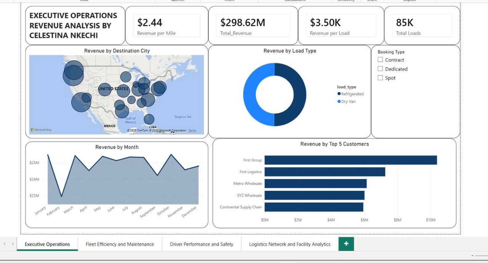
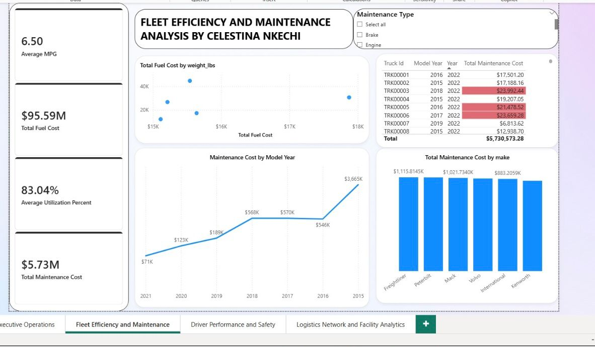
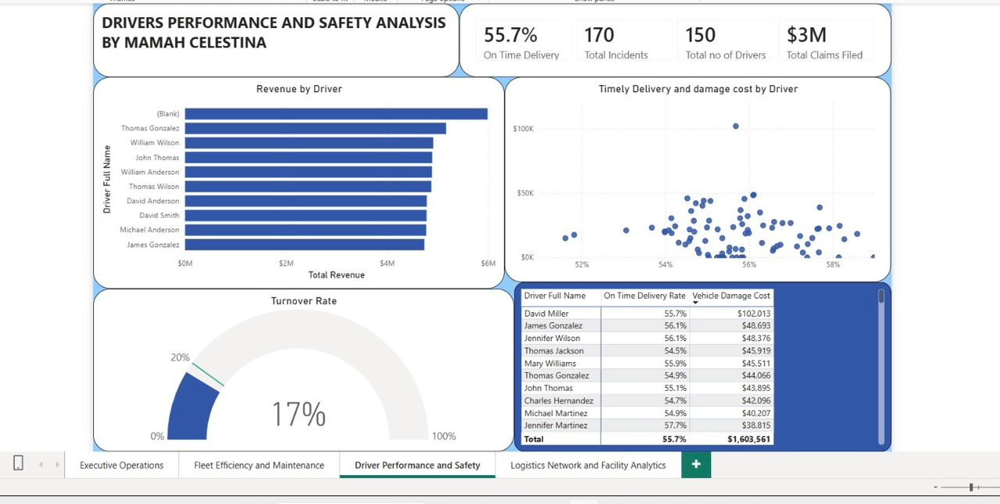
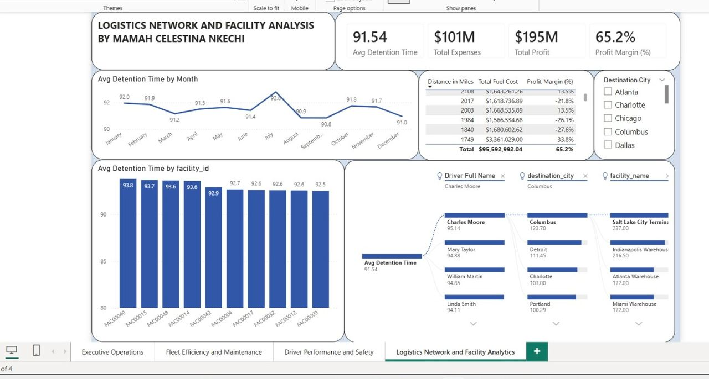

# 🚛 Logistics & Transportation Analytics Dashboard
### Power BI Capstone Project — Mamah Celestina Nkechi

---

## 📌 Project Overview

This capstone project is an end-to-end **Business Intelligence dashboard** built with **Microsoft Power BI**, designed to provide strategic insights into logistics and transportation operations. The report enables data-driven decision-making across four key operational domains: executive performance, fleet management, driver safety, and network facility analytics.

> **Tool:** Microsoft Power BI (Cloud — Release 2026.04)  
> **File:** `Mamah_Celestina's_Capstone_project.pbix`

---

## 🎯 Objectives

- Monitor and evaluate overall business revenue performance
- Track fleet utilization and maintenance costs
- Assess driver performance and road safety metrics
- Analyse logistics network efficiency across facilities and destinations

---

## 📊 Dashboard Pages

The report is structured across **4 interactive pages**:

---

### 1. 🏢 Executive Operations
A high-level overview of business performance for leadership and stakeholders.



| Metric | Value |
|---|---|
| Total Revenue | $298.62M |
| Revenue per Mile | $2.44 |
| Revenue per Load | $3.50K |
| Total Loads | 85K |

| Visual Type | Chart / KPI |
|---|---|
| KPI Cards | Revenue per Mile, Total Revenue, Revenue per Load, Total Loads |
| Donut Chart | Revenue by Load Type (Refrigerated vs Dry Van) |
| Area Chart | Revenue by Month |
| Map | Revenue by Destination City |
| Clustered Bar Chart | Revenue by Top 5 Customers |
| Slicer | Filter by Booking Type (Contract, Dedicated, Spot) |

**Key Questions Answered:**
- What is the total revenue for the period?
- Which load types and customers generate the most revenue?
- How does revenue trend month over month?
- Which destination cities are the most profitable?

---

### 2. 🚗 Fleet Efficiency and Maintenance
Monitors the health, efficiency, and upkeep of the vehicle fleet.



| Metric | Value |
|---|---|
| Average MPG | 6.50 |
| Total Fuel Cost | $95.59M |
| Average Utilization | 83.04% |
| Total Maintenance Cost | $5.73M |

| Visual Type | Chart / KPI |
|---|---|
| KPI Cards | Avg MPG, Total Fuel Cost, Avg Utilization %, Total Maintenance Cost |
| Scatter Chart | Total Fuel Cost by Weight (lbs) |
| Line Chart | Maintenance Cost by Model Year |
| Bar Chart | Total Maintenance Cost by Make (Freightliner, Peterbilt, Mack, Volvo, etc.) |
| Table | Per-truck maintenance breakdown with conditional formatting |
| Slicer | Filter by Maintenance Type (Brake, Engine, etc.) |

**Key Questions Answered:**
- Which vehicle model years incur the highest maintenance costs?
- Which truck makes are most expensive to maintain?
- Is there a correlation between vehicle weight and fuel cost?

---

### 3. 👩‍✈️ Driver Performance and Safety
Evaluates individual driver contributions to revenue and safety outcomes.



| Metric | Value |
|---|---|
| On Time Delivery Rate | 55.7% |
| Total Incidents | 170 |
| Total No. of Drivers | 150 |
| Total Claims Filed | $3M |

| Visual Type | Chart / KPI |
|---|---|
| KPI Cards | On Time Delivery %, Total Incidents, Total Drivers, Total Claims |
| Clustered Bar Chart | Revenue by Driver (Top earner: Thomas Gonzalez) |
| Scatter Chart | Timely Delivery vs. Damage Cost by Driver |
| Gauge | Turnover Rate (17%) |
| Table | Driver-level On Time Delivery Rate & Vehicle Damage Cost |

**Key Questions Answered:**
- Which drivers generate the most revenue?
- How does delivery timeliness relate to cargo damage costs?
- What is the driver turnover rate and which drivers pose the highest risk?

---

### 4. 🌐 Logistics Network and Facility Analytics
Provides a deep dive into the performance of logistics routes and facilities.



| Metric | Value |
|---|---|
| Avg Detention Time | 91.54 hrs |
| Total Expenses | $101M |
| Total Profit | $195M |
| Profit Margin | 65.2% |

| Visual Type | Chart / KPI |
|---|---|
| KPI Cards | Avg Detention Time, Total Expenses, Total Profit, Profit Margin % |
| Line Chart | Avg Detention Time by Month |
| Clustered Column Chart | Avg Detention Time by Facility ID |
| Decomposition Tree | Drill-down by Driver, Destination City, and Facility Name |
| Table | Distance, Total Fuel Cost, and Profit Margin per route |
| Slicer | Filter by Destination City |

**Key Questions Answered:**
- Which facilities have the highest detention times?
- What is the overall profit margin across the network?
- How do individual drivers and cities affect detention time?

---

## 🛠️ Tools & Technologies

| Tool | Purpose |
|---|---|
| Microsoft Power BI | Dashboard design and data visualisation |
| Power Query (M Language) | Data transformation and cleaning |
| DAX (Data Analysis Expressions) | Calculated columns and measures |
| Power BI Map Visual | Geospatial revenue analysis |
| Decomposition Tree | AI-powered drill-down analysis |

---

## 📁 Repository Structure

```
📦 Logistic_Analytics_Dashboard/
├── 📊 Mamah_Celestina_s_Capstone_project.pbix   # Main Power BI report file
├── 📄 README.md                                  # Project documentation (this file)

    ├── executive_operations.jpeg
    ├── fleet_efficiency.jpeg
    ├── driver_performance.jpeg
    └── logistics_network.jpeg
```

---

## 🚀 How to Open the Project

1. **Install Power BI Desktop** — Download from [Microsoft's official site](https://powerbi.microsoft.com/desktop/)
2. **Download or clone this repository**
3. **Open the file:** Double-click `Mamah_Celestina_s_Capstone_project.pbix` or open it from within Power BI Desktop
4. **Explore:** Use the slicers and filters on each page to interact with the data

---

## 📈 Key Insights

- **$298.62M total revenue** generated, with "First Group" as the top customer at ~$9M
- **Dry Van and Refrigerated** loads split revenue almost equally across booking types
- **2015 model year trucks** have the highest maintenance costs at $3.67M — suggesting fleet renewal priority
- **David Miller** has the highest vehicle damage cost ($102K) despite a 55.7% on-time delivery rate
- **65.2% profit margin** across the logistics network, with total profit of $195M
- **FAC00040** records the highest average detention time among all facilities at 93.8 hours

---

## 👩‍💻 Author

**Mamah Celestina Nkechi**  
Data Analytics Capstone Project  
📧 *(nkechicelestina8@gmail.com)*  
🔗 *(https://www.linkedin.com/in/celestinankechi)*

---

## 📜 License

This project is created for academic/capstone purposes. All rights reserved © Mamah Celestina Nkechi.

---

*Built with ❤️ using Microsoft Power BI*
